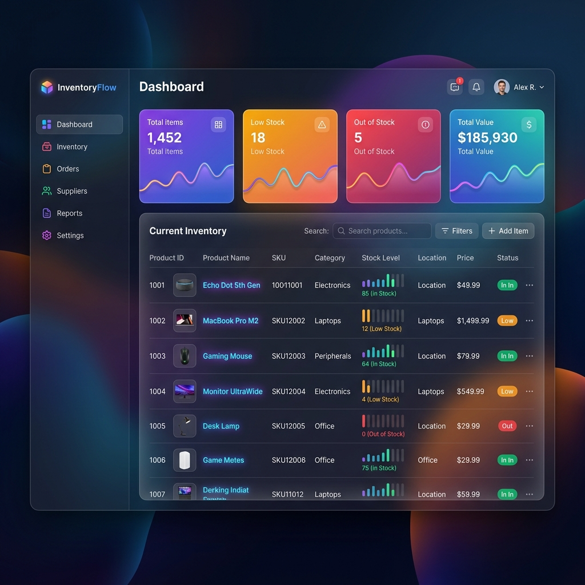

# Smart Inventory Manager



**Smart Inventory Manager** is a modern, glassmorphism‑styled web application that helps you track, organize, and visualize your inventory in real time. Built with vanilla HTML, CSS, and JavaScript, it offers a sleek, responsive UI with dynamic dashboards, item management, and analytics.

---

## ✨ Features

- **Dynamic Dashboard** – Real‑time tables, summary cards, and charts.
- **Responsive Design** – Works flawlessly on desktop and mobile.
- **Dark Glassmorphism UI** – Modern aesthetics with vibrant gradients.
- **Easy CRUD Operations** – Add, edit, delete items effortlessly.
- **Search & Filter** – Quickly locate inventory items.
- **Local Storage Persistence** – Data saved in the browser.

---

## 🚀 Demo

Below is a visual preview of the dashboard:


---

## 🛠️ Installation

```bash
# Clone the repository
git clone https://github.com/Harsha151606/smart-inventory-manager.git
cd smart-inventory-manager

# No dependencies – just open the app
open index.html
```

---

## 📖 Usage

1. Open `index.html` in a modern browser.
2. Use the **Add Item** button to create new inventory entries.
3. Edit or delete items directly from the table.
4. The dashboard updates instantly, reflecting the current state.

---

## 🤝 Contributing

Contributions are welcome! Please fork the repository, create a feature branch, and submit a pull request. Follow these steps:

```bash
git checkout -b feature/your-feature-name
# make changes
git commit -m "Add your descriptive commit message"
git push origin feature/your-feature-name
```

---

## 📄 License

This project is licensed under the MIT License – see the [LICENSE](LICENSE) file for details.

---

